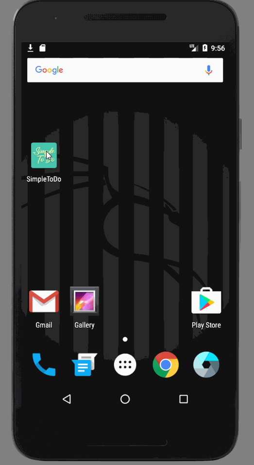

# Pre-work - *Simple ToDo*

**Simple ToDo** is an android app that allows building a todo list and basic todo items management functionality including adding new items, editing and deleting an existing item.

Submitted by: **Jinwoo Yom**

Time spent: **2** hours spent in total

## User Stories

The following **required** functionality is completed:

* [X] User can **successfully add and remove items** from the todo list
* [X] User can **tap a todo item in the list and bring up an edit screen for the todo item** and then have any changes to the text reflected in the todo list.
* [X] User can **persist todo items** and retrieve them properly on app restart

The following **optional** features are implemented:

* [ ] Persist the todo items [into SQLite](http://guides.codepath.com/android/Persisting-Data-to-the-Device#sqlite) instead of a text file
* [ ] Improve style of the todo items in the list [using a custom adapter](http://guides.codepath.com/android/Using-an-ArrayAdapter-with-ListView)
* [ ] Add support for completion due dates for todo items (and display within listview item)
* [ ] Use a [DialogFragment](http://guides.codepath.com/android/Using-DialogFragment) instead of new Activity for editing items
* [ ] Add support for selecting the priority of each todo item (and display in listview item)
* [X] Tweak the style improving the UI / UX, play with colors, images or backgrounds

The following **additional** features are implemented:

* [X] List anything else that you can get done to improve the app functionality!
  - Splash screen! :)

## Video Walkthrough

Here's a walkthrough of implemented user stories:

GIF created with [LiceCap](http://www.cockos.com/licecap/).

## Project Analysis

As part of your pre-work submission, please reflect on the app and answer the following questions below:

**Question 1:** "What are your reactions to the Android app development platform so far? Compare and contrast Android's approach to layouts and user interfaces in past platforms you've used."

**Answer:** There are definitely some pros and cons of android studio. Some of the pros include, clean and extremely customizable IDE, fast and smart auto-completion, smart package imports, and awesome preview screens. However, there are few cons which include horribly long installation process, glitchy compliers, and big IDE learning curve. As an expirienced developer, I was able to get up and running pretty quickly but I can definitely see beginners struggling to get their environment setup.  

**Question 2:** "Take a moment to reflect on the `ArrayAdapter` used in your pre-work. How would you describe an adapter in this context and what is its function in Android? Why do you think the adapter is important? Explain the purpose of the `convertView` in the `getView` method of the `ArrayAdapter`."

**Answer:** ArrayAdapter pretty much act as an linker between your datasets and your listview. In order to display your datasets to the UI, you need to first load it on to your ArrayAdapter and display it by linking the listview to the ArrayAdapter. This is important because it helps the UI component to be seperated from the datasets. In another words, UI component only needs to worry about displaying things that it is linked to without having to worry about storing or managing data. ConvertView is essentially the ListView's item cache that is not visible to make the list reusable. 

## Notes

Describe any challenges encountered while building the app.

I sneezed really hard and pulled my lower back muscle. It really hurt and was a biggest challenge that I encountered.

## License

    Copyright [2017] [Jinwoo Yom]

    Licensed under the Apache License, Version 2.0 (the "License");
    you may not use this file except in compliance with the License.
    You may obtain a copy of the License at

        http://www.apache.org/licenses/LICENSE-2.0

    Unless required by applicable law or agreed to in writing, software
    distributed under the License is distributed on an "AS IS" BASIS,
    WITHOUT WARRANTIES OR CONDITIONS OF ANY KIND, either express or implied.
    See the License for the specific language governing permissions and
    limitations under the License.